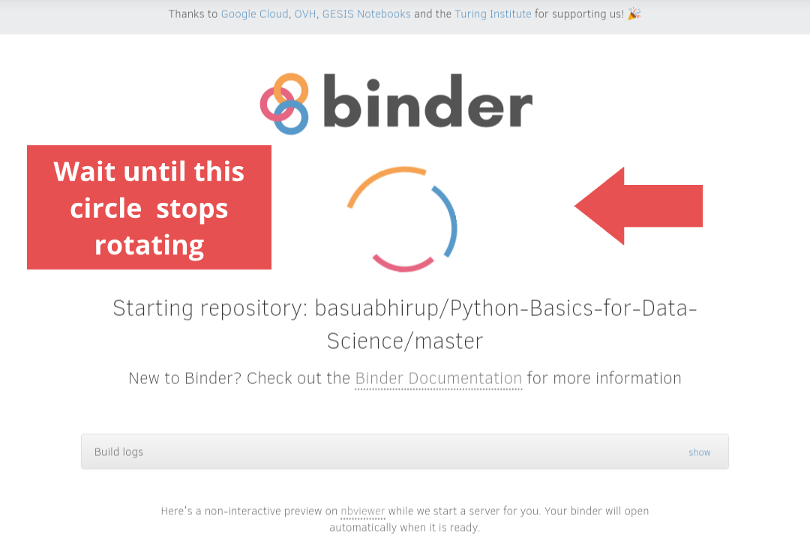

### ☝🏼☝🏼☝🏼 Click here to launch the binder.

Wait for a while for the binder to launch. It generally takes 1-2 minutes to connect to the cloud computational environment. Please keep patience. The binder page will be automatically refreshed after successfully starting the repository.

