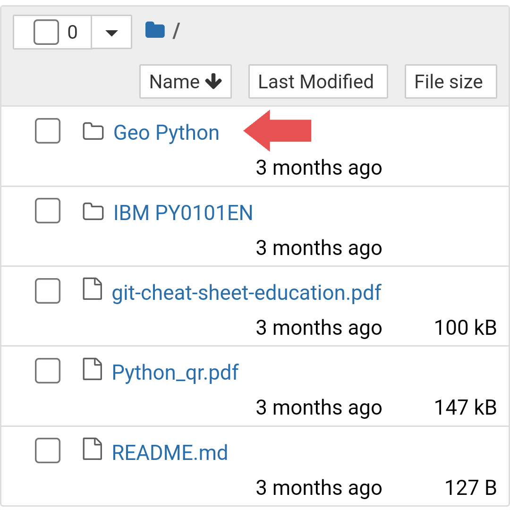
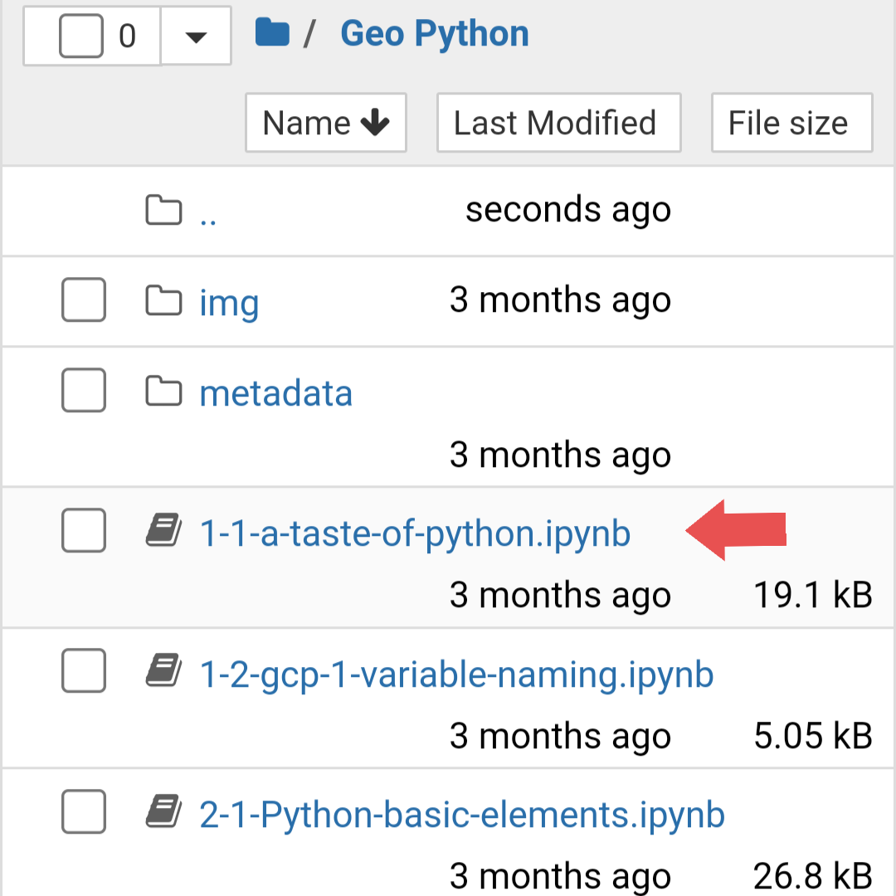

### ☝🏼☝🏼☝🏼 Click here to launch the binder.

Wait for a while for the binder to launch. It generally takes 1-2 minutes to connect to the cloud computational environment. Please keep patience.

#### The binder page will be automatically refreshed after successfully starting the repository. Then if you want to start learning from scratch, open the "Geo-Python" folder.

#### Now open the .ipynb files one by one, according to their serial number.

#### Read all the instructions inside the notebook and start learning.

Wish you all the Best 👍🏼😇

[- Abhirup Basu](https://github.com/basuabhirup)
